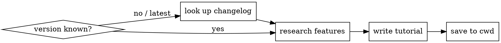

# Claude Code Release Tutorial

## Overview

Generates a comprehensive, hands-on tutorial for a Claude Code release. Covers every new feature with real copy-paste examples targeting beginners, intermediate users, and power users.

## Process



## Step 1 — Discover Version & Changelog

Dispatch a `claude-code-guide` subagent to look up the release. Do NOT rely on training knowledge for version details — changelogs must be fetched live.

**If version specified:**
```
Subagent prompt: "Look up the Claude Code v<VERSION> changelog. 
Return: (1) all new features, (2) performance improvements, 
(3) bug fixes with user impact, (4) security changes. 
Be exhaustive — do not summarize away any items."
```

**If "latest" or no version given:**
```
Subagent prompt: "What is the current latest version of Claude Code?
Look up its changelog. Return: (1) version number, (2) all new features, 
(3) performance improvements, (4) bug fixes with user impact, 
(5) security changes. Be exhaustive."
```

Sources the agent should check: official changelog at `code.claude.com/docs/en/changelog`, npm release notes, GitHub releases at `github.com/anthropics/claude-code/releases`.

## Step 2 — Classify Features

Group changelog items into tutorial sections. Every item must appear — do not skip anything:

| Type | Include? | Notes |
|---|---|---|
| New commands / flags | Yes | Always lead section |
| New env vars | Yes | Show all config options |
| Behavior changes | Yes | Before/after contrast |
| Performance fixes | Yes | Explain what was slow and why it matters |
| Bug fixes (user-visible) | Yes | Especially regressions and common workflows |
| Security hardening | Yes | Show how to verify / test |
| Internal refactors | Only if user-observable | Skip pure internals |

## Step 3 — Write the Tutorial

**File:** `docs/YYYY-MM-DD-claude-code-v<VERSION>-deep-dive.md` in cwd.  
If `docs/` does not exist, write to cwd root.

**Per-section structure (use for every feature):**

```markdown
## N. Feature Name

### What it is
One paragraph. No jargon. Accessible to someone new to Claude Code.

### Why it matters
Three labeled bullets:
**Beginner:** ...
**Intermediate:** ...
**Power user:** ...

### Hands-on
2–4 real examples. Each must be:
- Copy-pasteable as-is (no placeholders like <YOUR_VALUE> without context)
- Meaningful — demonstrates actual power, not "hello world"
- Runnable — shell commands, config JSON, or code that actually works
- Labelled with a realistic scenario title
```

**Example density target:** Each feature needs at minimum:
- 1 basic usage example
- 1 realistic workflow integration example  
- 1 power-user / automation / config example

## Step 4 — Tutorial File Header

Always open with:

```markdown
# Claude Code v<VERSION> — Deep Dive Tutorial

> **Date:** YYYY-MM-DD  
> **Audience:** Beginners → Power Users  
> **Goal:** Hands-on mastery of every new feature in v<VERSION>

---

## Table of Contents
[auto-generate from sections]
```

Close with a **Summary Table** mapping audience type to recommended starting section.

## Quality Checks Before Saving

- [ ] Every changelog item has its own section — none merged or skipped
- [ ] Every section has at least 2 copy-paste examples
- [ ] No placeholder text left (no `<YOUR_X>` without a concrete default)
- [ ] Beginner / Intermediate / Power user labels present in every "Why it matters"
- [ ] Table of contents matches actual sections
- [ ] File saved to `docs/` or cwd root

## Common Mistakes

| Mistake | Fix |
|---|---|
| Skipping "minor" bug fixes | All user-visible fixes get a section — they unblock real workflows |
| Toy examples ("hello world") | Use realistic project contexts: CI pipelines, multi-file refactors, Docker |
| Merging multiple features into one section | One section per changelog item — discoverability depends on it |
| Relying on training data for version details | Always dispatch subagent to fetch live changelog |
| Writing only for one audience tier | Every section needs all three tiers labeled |
